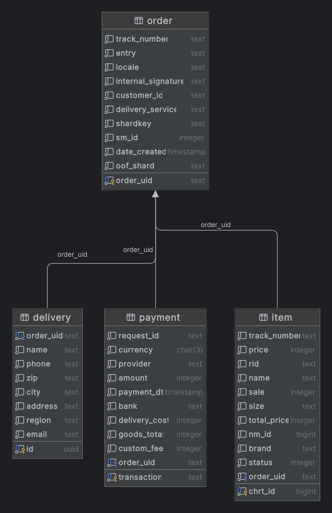

# Сервис обработки заказов

Система предназначена для обработки поступающих из `NATS streaming` заказов.
Представлены 2 сервиса
- Сервис обработки заказов `wborder` (основной)
- Сервис отправки сообщений в Nats streaming `natsproducer`

Краткое описание:
1. В сервисе `natsproducer` доступно api для отправки заказов (без ошибок и с ошибками)
2. В сервисе `wborder` доступно api для поиска заказа по id, получения всех заказов, просмотра статистики обработки
2. Основной сервис асинхронно обрабатывает поступающие заказы.
3. Реализован простейший `cache` в виде `map` (TODO заменить на redis)
4. Конфигурация сервиса через соответствующие `env` файлы или `docker-compose` файл
5. Реализованы тесты с использованием `testcontainers` (требуется `docker` TODO дополнить и расширить)

Используемые технологии:
- PostgreSQL/pgx
- Docker/Docker compose
- NATS Streaming/stan
- Echo
- golang-migrate/migrate
- testcontainers, testify
- go-playground/validator

### Запуск проекта
Запуск возможен в т.ч. с использованием
- [Docker](https://docs.docker.com/engine/install/)
- [Docker compose](https://docs.docker.com/compose/install/)

1. Скопировать проект `git clone`
2. Выполнить команду из корня `docker compose up`

Для тестирования приложения можно воспользоваться [коллекцией `postman` запросов](wb-order-demo.postman_collection.json)

Схема базы данных (в т.ч. [скрипт создания бд](internal/storage/db/migrations/000001_wb_order_schema.up.sql)).
